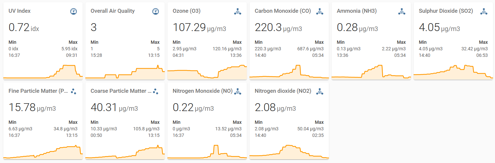

 [](https://github.com/custom-components/hacs) [](https://github.com/custom-components/hacs)  

# ha-cc-openweathermap_all
Home Assistant custom component combining multiple OpenWeatherMap API calls

## Installation

### Automatic
Use HACS to install it.

### Manual
Copy the files to their proper location

## Usage

`configuration.yaml`:
```yaml
sensor:
    - platform: openweathermap_all
      api_key: YOUR_API_KEY
      latitude: YOUR_LATITUDE
      longitude: YOUR_LONGITUDE
```

### Explanation
`YOUR_API_KEY`: API key to use with the service. You can obtain yours at [OpenWeatherMap](https://home.openweathermap.org/api_keys).<br>
`YOUR_LATITUDE`, `YOUR_LONGITUDE`: coordinates of the desired location.

## Sensors created
Currently, the following sensors are created by this integration:
- sensor.owm_pollution_ammonia_nh3
- sensor.owm_pollution_carbon_monoxide_co
- sensor.owm_pollution_coarse_particles_pm10
- sensor.owm_pollution_fine_particles_pm2_5
- sensor.owm_pollution_nitrogen_dioxide_no2
- sensor.owm_pollution_nitrogen_monoxide_no
- sensor.owm_pollution_overall_air_quality
- sensor.owm_pollution_ozone_o3
- sensor.owm_pollution_sulphur_dioxide_so2
- sensor.owm_ultraviolet_index

More are coming in the future as the API, my free time and my skills allow. :)

## Sample screenshot of sensors (using [mini-graph-card](https://github.com/kalkih/mini-graph-card))



## Contributing
Pull requests are welcome. For major changes, please open an issue first to discuss what you would like to change.

Please make sure to update tests as appropriate.

## License
[GNU General Public License v3.0](https://choosealicense.com/licenses/gpl-3.0/)
